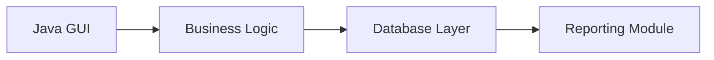
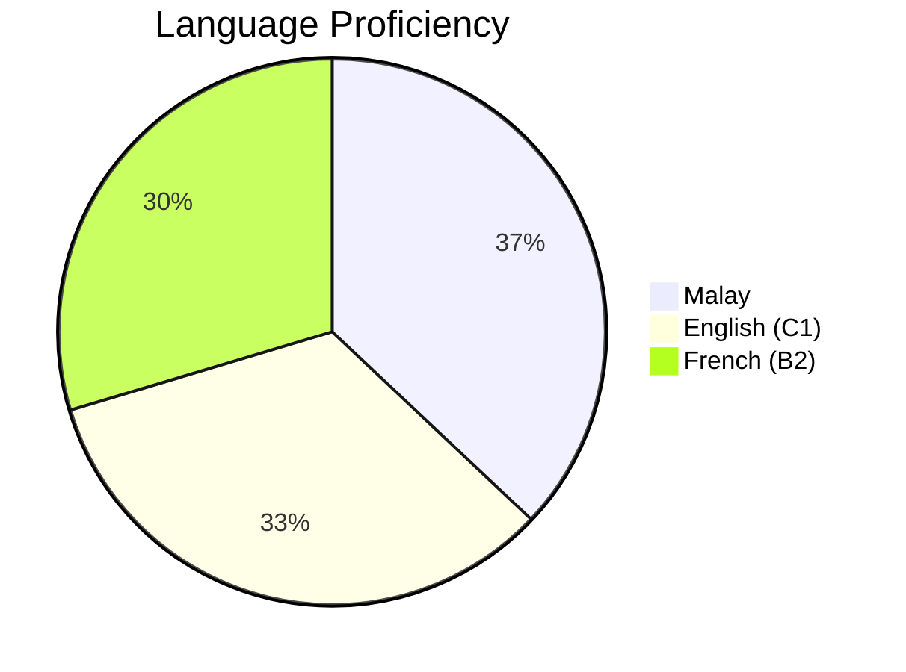

<div align="center">
  
# 👨‍💻 Ian Binsyahrul Azlan
  
[](https://git.io/typing-svg)


</div>

<p align="center">
  
  
  
</p>

## 🎯 About Me


```typescript
const ianni = {
    education: "University of Toulouse",
    specialization: "Application Development",
    availableForInternship: true,
    internshipPeriod: "April-June 2026",
    duration: "10-12 weeks",
    passions: ["Software Development", 
               "Problem Solving", 
               "Innovation"]
};
```

## 💻 Tech Stack
<div align="center">

| Category | Technologies |
|----------|-------------|
| **Languages** |     |
| **Web** |   |
| **Database** |   |
| **Tools** |    |

</div>

## 🚀 Featured Projects

<details>
<summary>🅿️ Parking Management System</summary>

```java
public class ParkingHighlights {
    String[] features = {
        "Real-time parking space tracking",
        "PL/SQL database integration",
        "Java GUI implementation",
        "Automated reporting system"
    };
}
```
</details>

<details>
<summary>🎮 League of Legends Statistics</summary>

```sql
SELECT feature FROM project_highlights
WHERE project = 'LoL Stats'
-- Results:
-- → APEX Database Integration
-- → Real-time Stats Tracking
-- → Interactive Dashboards
```
</details>

<details>
<summary>💼 Sales Application</summary>


</details>

## 📊 GitHub Activity

<div align="center">
  
  
</div>

## 🌍 Languages


## 📫 Connect With Me
<div align="center">
  
[](https://github.com/ianniboss)
<!-- Add your other social links here -->

</div>

<div align="center">
  
### 🎯 Open for Internship Opportunities
#### April-June 2026 | Toulouse, France


</div>
